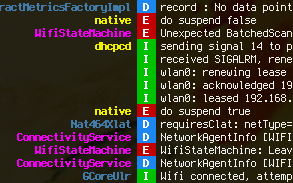

# rubcat

simply pidcat in Ruby.

## Installation

Just execute:

    $ gem install rubcat

## Options

    -l, --level={V,D,I,W,E,F}        Minimul level to display
    -s, --serial=DEVICE_SERIAL
    -d                               Use first device for log input (adb -d option)
    -e                               Use first emulator for log input (adb -e option)
    --tag-length=LENGTH          Length of tag shown in left of screen (default is 25)
    --split-tags                 Insert empty line between tags

## Contributing

1. Fork it ( https://github.com/polamjag/rubcat/fork )
2. Create your feature branch (`git checkout -b my-new-feature`)
3. Commit your changes (`git commit -am 'Add some feature'`)
4. Push to the branch (`git push origin my-new-feature`)
5. Create a new Pull Request
